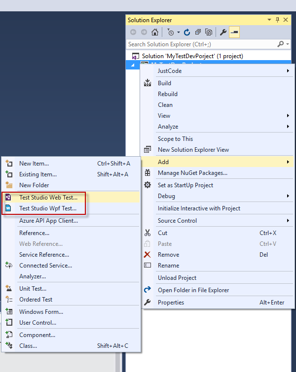
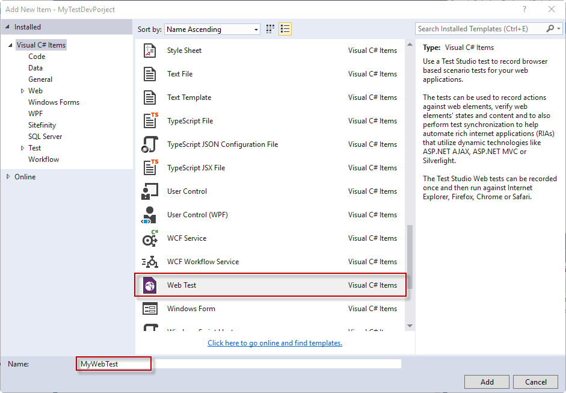
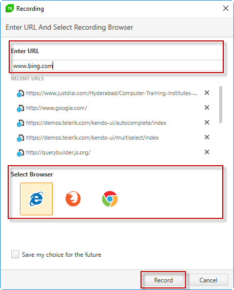
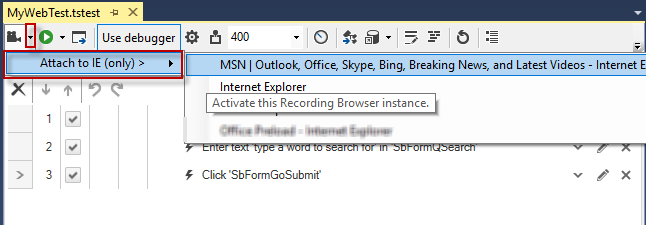

# Record a Test

> Once a recording session is started __do not start another instance of the same browser__ until the session is finished!

To add new test in the project click with the right mouse button on the project name in Solution Explorer, select _Add_ and choose between _Test Studio Web Test..._ or _Test Studio WPF Test..._.

The respective item is selected in the list of items, type a name and click _Add_.

## Record a Web Test

>__Note!__ The supported for __recording browsers__ are __Internet Explorer__, __Chrome__ and __FireFox__

Double click a web test from the Solution Explorer to open it. Click on the _Record_ button to start the recording process.

In the dialog that pops up enter the URL to record a test against and select the recording browser. Then click on __Record__ button.

The URLs recently used for recording will be listed in the _Recent URLs_ section where you can select directly any of them.

The recording browser will start and navigate to the selected URL. Once the URL is fully loaded the <a href="/features/recorder/recording-toolbar" target="_blank">Test Studio Dev Recorder Toolbar</a> will be attached to the browser and you can start performing the desired scenario. Each action against the page will be automatically recorded and presented by a single step in the test. 

To stop the recording session close the browser.

## Record a WPF Test

Double click a WPF test from the Solution Explorer to open it. Click on the _Configure WPF Application_ button.

The _Configure WPF Application Path_ wizard appears. There are two options to determine the default application to launch for a WPF test.

* __WPF Application Path__ - drag and drop the application shortcut icon into this text box, or click __Browse__ and locate it manually.
* __Current Path Expanded__ - the field is read-only and display the full path to application if environment variables are used.
* __Use default path__ - whether to use the path set here or the default path set in Project Settings > Others __(add link to the article)__.
* __Active WPF Applications__ - Progress Test Studio detects all WPF apps currently running and lists them. Highlight the desired app and press Select Application.
* __Recording Options__ - whether to record window state changes.

Click on _OK_ button to confirm the configuration. 

Once you have configured the test click on the _Record_ button to launch a new instance of the application to record against.

The <a href="/features/recorder/recording-toolbar" target="_blank">Test Studio Dev Recorder Toolbar</a> will be attached to the application instance and you can start performing the desired scenario. Each action against the application will be automatically recorded and presented by a single step in the test. 

To stop the recording session close the WPF application. 

## Attach the Recorder to a Running Instance

The Test Studio Dev Recording Toolbar can be also attached to an already running instance of __WPF application__ or __Internet Explorer__ only. Click the black arrow on the right side of _Record_ button and select the _Attach to_ option. 

The screenshot demonstrates the option for web test but is available in WPF test as well.