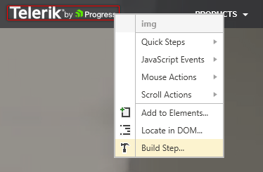
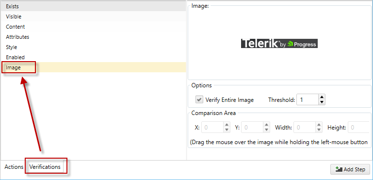
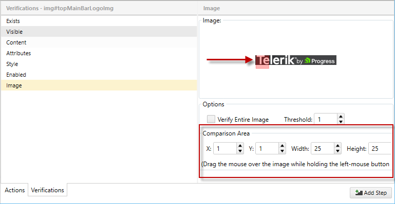
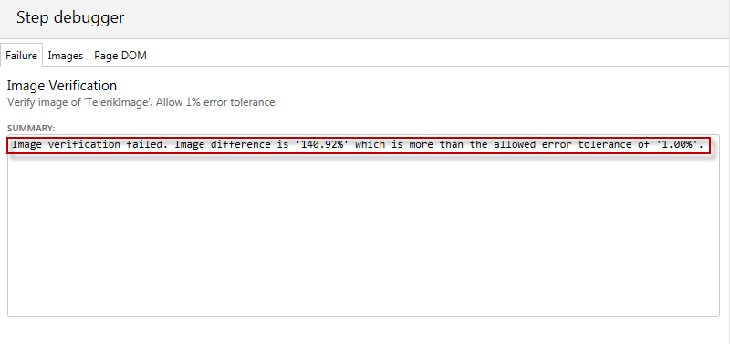
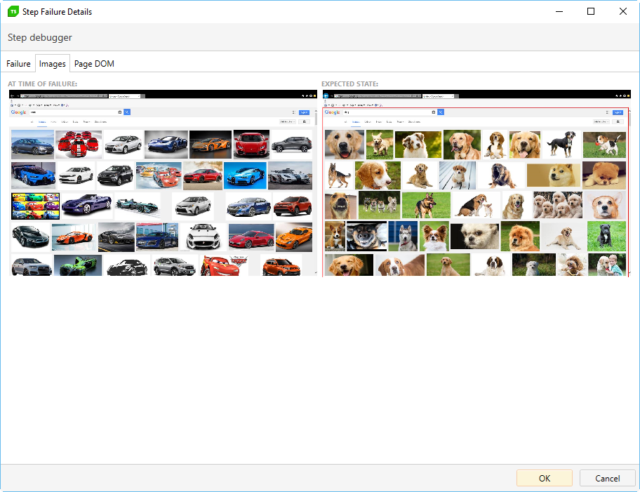

# Image Verification

It is possible to build an image verification against specific elements for pixel-by-pixel visual verifications in tests. The image verification feature is based on an element’s visual rendering rather than the properties or attributes of that element. An application with rich graphic rendering can leverage this functionality to automate some of its test scenarios that have always needed manual visual inspection to verify. The image verification in Test Studio allows you to refine your verification area down to the pixel level within an element and also assign error tolerance for the matching.

> Please note that:
> - In a web application it is possible to record image verification only while recording in Internet Explorer browser!
> - We recommend using Image Verification as a **last resort** as it is inherently fragile. Always use the DOM as your primary means of verification, even with images.

## Best practices

There are few things that could ensure relative stability during test execution:

&nbsp; &nbsp;  Use the same video hardware and OS for recording and execution. If execution would be performed on different machine it should be as similar as possible to the recording one. Using RDC for remote execution would improve test execution results since video settings should be the same as the initial machine.

&nbsp; &nbsp;  Use same browser as the one that the verifications steps were recorded on. Even different browsers versions could differ in verification results.

&nbsp; &nbsp;  Attributes such as *src* and *alt* typically result in more reliable verifications. You can create an <a href="/features/recorder/verifications/advanced-verification" target="_blank">Advanced Verification</a> based on Attributes in the Sentence Verification Builder: \

&nbsp; &nbsp;  Use Image Verification when you need to verify an exact and static image, such as a logo, button, or icon.

&nbsp; &nbsp;  Do not use Image Verification to verify a specific color, an image with text content, or a dynamic slide show.

## Steps to record an image verification in a web test

1.&nbsp; Create a Web Test and click Record.

2.&nbsp; Navigate to www.telerik.com.

3.&nbsp; Make sure that the image is in the visible part of the application page. To ensure that during the test execution - a "scroll to top" action could be applied to the image or to the element just on top of it.

4.&nbsp; Enable highlighting from the Recorder.

5.&nbsp; Hover over the Telerik logo and select **Build Step...**

6.&nbsp; In the Recorder click **Verifications > Image** :

By default, **Verify Entire Image** is checked and the **Tolerate Difference** is 1%.

> We recommend keeping the Tolerate Difference between 1 and 5%. A setting of 0 equals an exact match and the verification will fail if it is off by a single pixel.

7.&nbsp; Uncheck **Verify Entire Image** to refine the comparison area. Either enter coordinates or drag the desired selection area over the image.

8.&nbsp; Click **Add Step** and notice the Verify image step added to the test.

9.&nbsp; If you receive a failure on an Image Verification, double click the red and white **X** next to the step. The **Failure** tab displays the percentage difference versus the allowed tolerance.

10.&nbsp; The **Images** tab displays the actual versus expected images.

